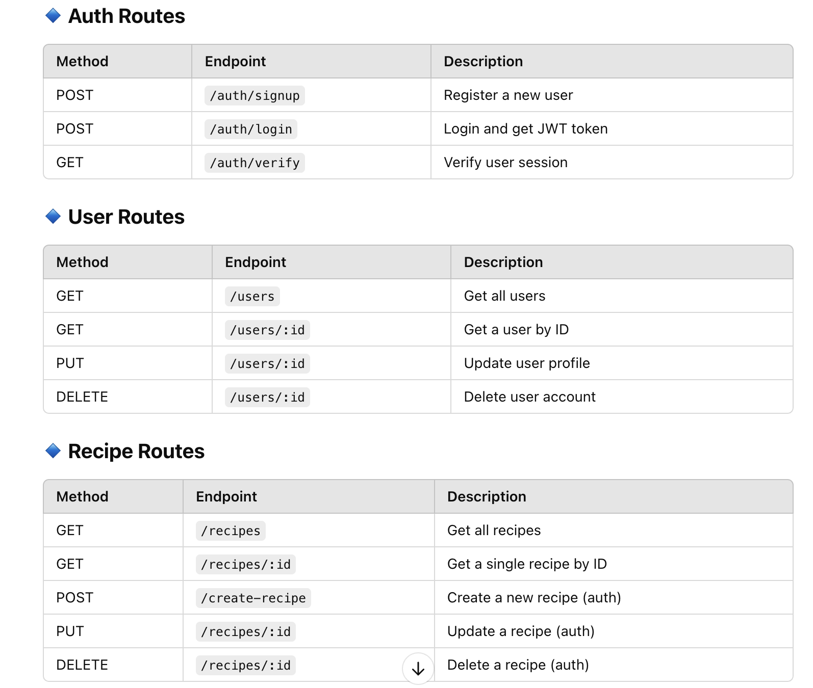

# welcome to our Simplydelicious Recipes project!

## Simply Delicious Recipes API

This is the backend for **Simply Delicious Recipes**, a full-stack application that allows users to create, manage, and share recipes. Built with **Node.js, Express, Prisma, PostgreSQL, and JWT authentication**, this API serves as the backbone of the application.

## 🛠️ Technologies Used
- **Node.js** - Backend runtime
- **Express.js** - Web framework for handling routes
- **Prisma** - ORM for PostgreSQL
- **PostgreSQL** - Database for storing users and recipes
- **JWT (JSON Web Token)** - Authentication and authorization
- **bcrypt** - Secure password hashing
- **CORS** - Cross-origin resource sharing

## 📌 Features
- **User authentication** (signup, login, token verification)
- **JWT-based authentication & authorization**
- **CRUD operations** for users and recipes
- **Protected routes** with middleware
- **Recipe filtering by categories (Lunch, Breakfast, etc.)**
- **PostgreSQL database integration with Prisma**

## 🚀 Getting Started

### 1️⃣ Clone the repository
git clone https://github.com/CodeCuisin/simplydelicious-server
 
cd simplydelicious-server

### 2️⃣ install dependencies
run 
npm install

### 3️⃣ Set up environment variables
DATABASE_URL=your_postgres_database_url
TOKEN_SECRET=your_jwt_secret_key
PORT=5005

### 4️⃣ Run database migrations
npx prisma migrate dev --name init

### 5️⃣ Start the server
npm run dev

## 📌 API Routes

## 🛠️ Deployment
This API is deployed using Netlify for frontend and Render for backend.
 
[deployment on Netlify](https://simply-delicious-recipes.netlify.app)

